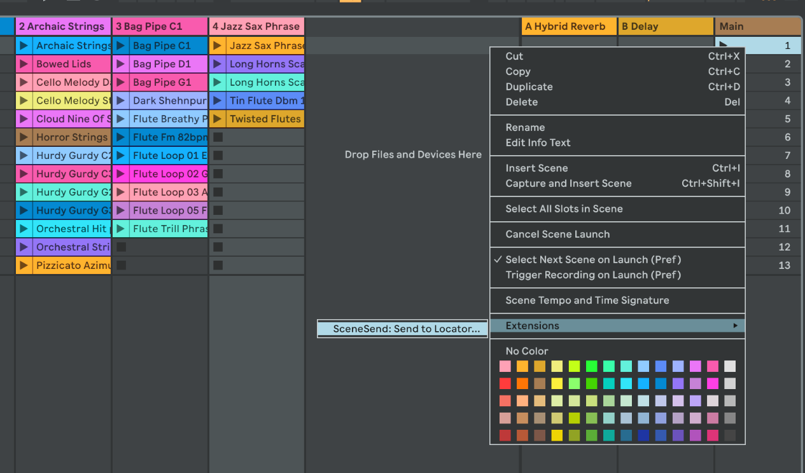
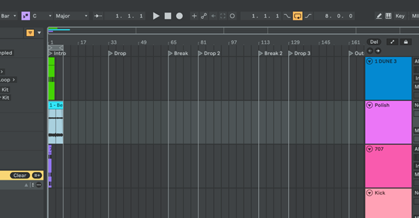

# Ableton SceneSend

Ableton Live 12 Extension — right-click any Scene row and copy every clip in
that row into the Arrangement at a chosen locator. Session clips stay put.




## Features

- Right-click a Scene → pick a named locator → all clips in that row land in Arrangement
- Works with both MIDI and audio clips
- **Loop clips until next locator** — each clip repeats to fill the gap, last copy truncated if needed; repeated copies snap to bar boundaries
- **Cut clips at next locator** — clips longer than the gap are truncated independently of looping
- No looping past the last locator (clips would run forever)
- Respects the scene's time signature for bar-snapping (3/4, 6/8, etc.)
- Open-ended session clips handled (derives duration from note content)

## Install

Drag `scene-send.ablx` onto Ableton Live 12 Beta.
Developer Mode is only needed when building from source — turn it off for normal use.

## Usage

1. **First:** install [ableton-cue-templates](https://github.com/xmllint/ableton-cue-templates)
   to quickly drop genre-specific locators into your arrangement.
2. Right-click any Scene row → **Send to Locator…**
3. Pick a locator and set options:
   - **Loop clips until next locator** — fills the gap by repeating each clip; copies land on bar boundaries
   - **Cut clips at next locator** — truncates any clip that runs past the next locator
4. All clips in that row appear in Arrangement at the chosen locator position

## Build from source

```bash
npm install
npm run build       # tsc + esbuild
npm run package     # creates .ablx
```

Requires the Ableton Extensions SDK v1.0.0-beta.0 (Centercode beta program).

## License

MIT
